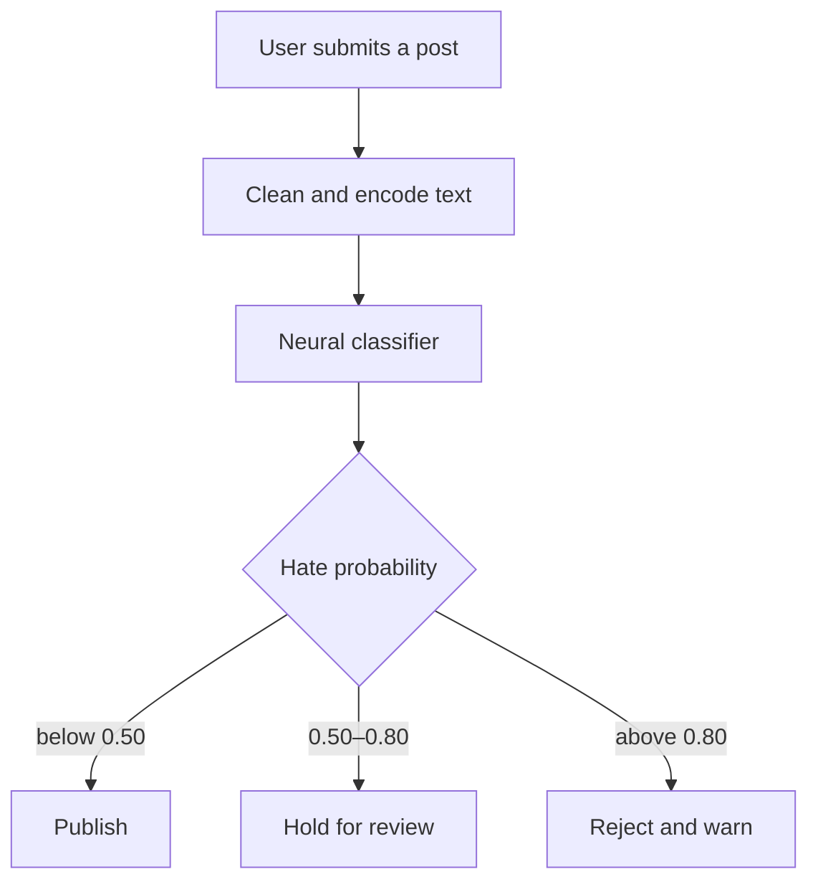

# AI-Moderated Social Network

[](https://github.com/YesserRya/L3Project/actions/workflows/tests.yml)


A solo bachelor's capstone project: a Django social-network prototype that uses a neural text classifier to moderate posts before they enter the public feed.

The project combines a conventional social application—profiles, following, text and image posts—with an ML-assisted moderation workflow. Each submitted text post receives a hate-speech probability and is either published, held for review, or rejected according to configurable thresholds.

> This is an academic prototype, not a production moderation system. Automated moderation can produce harmful false positives and false negatives and should retain meaningful human oversight.

## What it demonstrates

- Integration of a trained TensorFlow model into a Django request flow
- Text preprocessing and binary hate-speech classification
- Threshold-based routing for automatic and human moderation
- User profiles, follow/unfollow relationships, and personalised feeds
- Text and image publishing with Django forms and models

## Moderation workflow



## Model

The classifier uses a learned word embedding followed by global average pooling and dense layers:

```text
Token sequence → Embedding → GlobalAveragePooling1D → Dense (ReLU) → Sigmoid
```

It was trained for binary classification on the **Dynamically Generated Hate Speech Dataset**, which contains approximately 40,000 synthetic examples produced and labelled through a human-and-model-in-the-loop process.

The original experiment recorded the following held-out metrics:

| Metric | Score |
|---|---:|
| Accuracy | 0.750 |
| Weighted F1 | 0.678 |
| Macro precision | 0.648 |
| Macro recall | 0.628 |

These results describe the original academic experiment and should not be interpreted as evidence of production readiness or fairness across demographic groups.

## Project structure

```text
.
├── Mymedia/               # Django models, forms, views, URLs and templates
├── media/                 # Django project configuration
├── models/                # Saved classifier and vocabulary
├── notebooks/             # Model-training and vocabulary experiments
├── tests/                 # Unit tests for moderation rules
├── manage.py
├── requirements.txt
└── .env.example
```

## Run locally

The original model was developed with Python 3.8. Create an isolated environment before installing its dependencies.

```bash
python -m venv .venv
source .venv/bin/activate
pip install -r requirements.txt
```

Configure Django using environment variables. The included `.env.example`
documents the available settings; export them in your shell or development
environment:

```bash
export DJANGO_SECRET_KEY="replace-this-with-a-random-local-secret"
export DJANGO_DEBUG="True"
```

Initialise the application and create your own administrator account:

```bash
python manage.py migrate
python manage.py createsuperuser
python manage.py runserver
```

Sign in first through Django administration at [http://127.0.0.1:8000/admin](http://127.0.0.1:8000/admin), then open [http://127.0.0.1:8000](http://127.0.0.1:8000) to use the application.

## Dataset and attribution

The training experiment uses the [Dynamically Generated Hate Speech Dataset](https://github.com/bvidgen/Dynamically-Generated-Hate-Speech-Dataset), released under CC BY 4.0.

> Bertie Vidgen, Tristan Thrush, Zeerak Waseem, and Douwe Kiela. “Learning from the Worst: Dynamically Generated Datasets to Improve Online Hate Detection.” ACL-IJCNLP 2021. [Paper](https://aclanthology.org/2021.acl-long.132/)

The dataset contains synthetic hateful language and may be distressing to inspect.

## Limitations and next steps

- The classifier is a research prototype and has not been audited for demographic bias.
- Thresholds were selected for the demonstration and require validation for any real deployment.
- Image content is not analysed; only the accompanying text passes through the classifier.
- A production system would require authentication hardening, audit logging, model monitoring, explainability, appeals, and human review tooling.

## Author

**Yesser Rizi** — AI and Data Science Engineer  
[LinkedIn](https://www.linkedin.com/in/yesser-rizi-b812a0248/) · [GitHub](https://github.com/YesserRya) · [Kaggle](https://www.kaggle.com/yesserrya)
